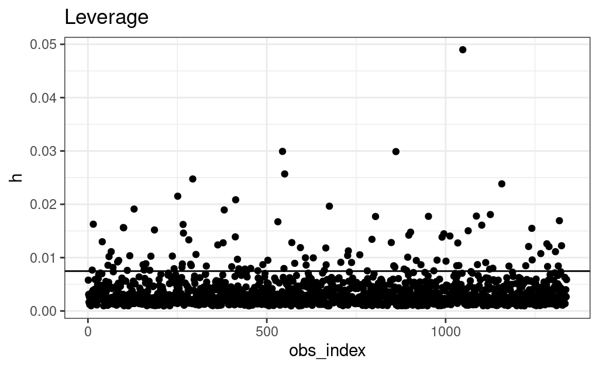
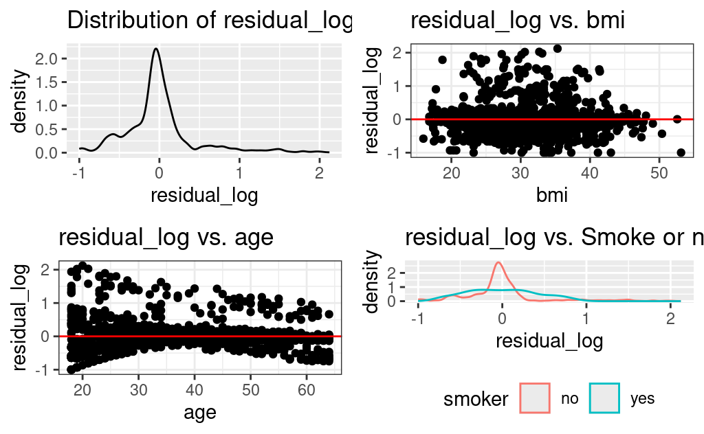

# Health Expense Prediction using Multiple Linear Regression Approach

## Introduction

From the perspective of the health insurance company, the medical expenses of the beneficiaries have direct impact on whether or not the cost of the insurance plan should be increased/decreased (in order to maximize profit). Therefore, they are especially interested in predicting the medical expenses, in order to gain insights into the potential predictors that might correlate with a change in this factor. 

### Dataset

The data set we look at is a synthetic data set that uses **actual demographic statistics from the US Census Bureau**. Therefore, it can give an approximate of real-world conditions. 

There are 1338 observations, each representing an individual enrolled in the insurance plan. There are 7 demographic statistics of concern: age, sex, BMI (which is a metric used to measure a person's weight wrt. height), number of children, smoking habits, and region of residence in the US. For this analysis, as expected, we will treat `charges` as the response variable, and the other 6 variables as potential explanatory variables.

### Hypotheses

$H_0: \text{Age, sex, BMI, number of children, smoking habits, and region of residence are not associated with a change in average medical expense.}$

$H_A: \text{At least one of those factors are associated with a change in average medical expense.}$

### Summary statistics

**1. Examining the numerical variables**

Just from visual inspection, focusing on the last row, we observe a few things:

- There seems to be positive correlation between `age` and `charges`. In the plot, there are 3 clouds of points corresponding to each tier of charges. For each cloud, the positive correlation can be seen.
- The same with `bmi` and `charges`. There seems to be 2 tiers of charges, each both have a positive correlation with `bmi`.
- On the other hand, there is little to no relationship between `charges` and number of children.

**2. Examining the categorical variables**

Smoking habit seems to be the factor that is most related with the change in `charges`. Specifically, the yes group (corresponding to the smoker group) tends to be associated with higher amount of charges.

## Method

### Final Model Equation

Using the BIC metric, we were able to confirm that the best model (model 4) included these variables: `age`, `bmi`, `children`, `smoker`. However, as observed above, we may encounter a problem with linearity condition if we include `children` in the model. Specifically, `children` when standing alone has visibly no correlation with `charges`. Our simple linear regression results for these 2 variables alone, even after some trials of transformation, also proved this point. That leads us to select just 3 variables: `age`, `bmi`, `smoker`. 

Remember that we noticed that there are clearly 2 distinct clouds in the `bmi` vs. `charges` plot. When we look closely into the interactions between the 4 variables selected, we also observe the 2 distinct slopes for each smoker group, meaning: an additional increase in the `bmi` for people who don't smoke is associated with *less increase* in `charges` compared with people who smoke.   

This guides us to add an interaction for `bmi` and `smoker` in our final model to account for the pattern we observed:

Estimated model:

$\hat{\mu}(\text{charges}_i | X_i) = -2290.008 + 266.758 \times \text{age} \\ + 7.109 \times \text{bmi} \\ - 20093.508 \times I(\text{smoker = yes}) \\ + 1430.920 \times (\text{smoker_yes} \times \text{bmi})$

The predictors $X_i$ are:

- $X_1$: age
- $X_2$: bmi
- $X_3$: indicator for smoke group (1 if that individual smokes, 0 otherwise)
- $X_4$: $x_3 \times bmi$

### Assumptions with Diagnostic plots

1.  Independence: There is not enough information to conclude about whether the patients included in this data set, by any chance, are related (there is no information on how the individuals with these demographic statistics are selected). In this case, we have to assume independence.

2.  Linearity:

-  Residuals vs BMI: we differentiate `smokeryes` and `smokerno` with colors and notice the patterns as in the plot above, which makes us unsure about whether this condition is met. As shown before, there are 2 distinct slopes for each smoker group, which we have accounted for using the interaction term. 

-  Residuals vs age: the linearity is met (no observable pattern).

4.  Equal variance of residuals: The variance of the residuals for each smoker group indicates the equal variance condition satisfaction since the standard deviations are roughly similar (ratio = 1.19).

4.  Outliers: Across all metrics for identifying outliers, we observe the same pattern: there are many points above the cutoff line y-intercepting at 0.0075 in the Leverage plot which we suspect to be outliers.

5. Normal distribution of residuals: Looking at the distribution of the residual, the plot looks quite symmetric. There is right-skewness present in the plot, which we will attempt to transform to meet this condition.

6. Multicollinearity: As observed in part 1, and also confirmed in the results of the VIF metric, we can see that there is no concerning correlation between the variables.

### Transformations

So there are 2 conditions which we will need to meet: outliers and normal distribution of residuals. 

#### Outliers

Using the threshold $2 \times 5/\text{number of rows}$ as a threshold, there are in fact 156 outliers in this dataset! 

Among the 3, this threshold seems to show the most outliers (109 for Studentized, much fewer for Cook's distance). Just to make sure we handle the worst case scenario, we performed a quick analysis of the model with and without the suspicious data:

- The p-values for the parameters do not significantly change.
- The estimates: 
  - Change in `age` and `bmi` coefficients: new estimates are < 3 SDs away from the old ones 
  - Change in $I(smoker=yes)$ and interaction term coefficients: most significant change

#### Normal distribution of residuals

We determine a set of transformations for `charges`, `age` and `bmi` according to our findings in the simple linear regression analysis as follows:

Based on our observation:

- Linearity for `age` vs. `charges` is unmet for this transformation. There is a curve in this plot once we take the log of charges, which is visible even with an additional term $age^3$.
- But other conditions are more or less met. 

### Model statement for the other models 

Going back to our BIC results, if we disregard the fact that children has little to no correlation with `charges`, we can see that there are 2 other models with equally good performance: model 4 and 5.

If we still keep the same interaction term across these models, there estimated equations would be:

Model 4: `age`, `bmi`, `children`, `smoker`

$$\hat{\mu}(\text{charges}_i | X_i) = -2729.002 + 264.948 \times \text{age} \\ +508.924 \times \text {children} \\ + 5.656 \times \text{bmi} \\ - 20194.709 \times I(\text{smoker = yes}) \\ + 1433.788 \times (\text{smoker_yes} \times \text{bmi})$$

Model 5: `age`, `bmi`, `children`, `smoker`, `regionsoutheast`

For this model, we need to create a new variable `region_new` that groups all regions other than southeast into 1 group.

$$\hat{\mu}(\text{charges}_i | X_i) = -2902.567 + 264.231 \times \text{age} \\ + 17.308 \times \text{bmi} \\ - 20153.078 \times I(\text{smoker = yes}) \\ + 503.458 \times \text {children} \\ - 582.178 \times I(\text{region = southeast}) \\ + 1433.826 \times (\text{smoker_yes} \times \text{bmi})$$

### Comparison between models

In terms of BIC and adjusted R squared, the 3 models perform relatively well. 

### Significant parameters in the final model

In our final model, from the summary, we can see that `age`, `smoker`, and the interaction term are statistically significant in predicting mean charge. `bmi` when standing alone actually is not a significant term in the model.

## Results

### Interpretation

### Specific numerical results

## Discussions and Conclusions

### Limitations

-   Even though the characteristics of the observations are claimed to be taken from real-world data, the expenses are simulated. Meaning there are limits to the population we can extend the results to.

-   Data on medical expenses may be kept private (example, like in medical records), so it can be hard to access those.

### Future work

-   The model can be used to predict medical expenses for reference purposes but restricted to some particular population with similar statistics as those in this study.

-   We will perform other transformations to see if we can still find a better model.

-   Move on and learn new tools to predict other stuff on this dataset.

## References

Datta, A. (n.d.). US Health Insurance Dataset. [online] www.kaggle.com. Available at: <https://www.kaggle.com/datasets/teertha/ushealthinsurancedataset/discussion/156033> [Accessed 26 Mar. 2024].

